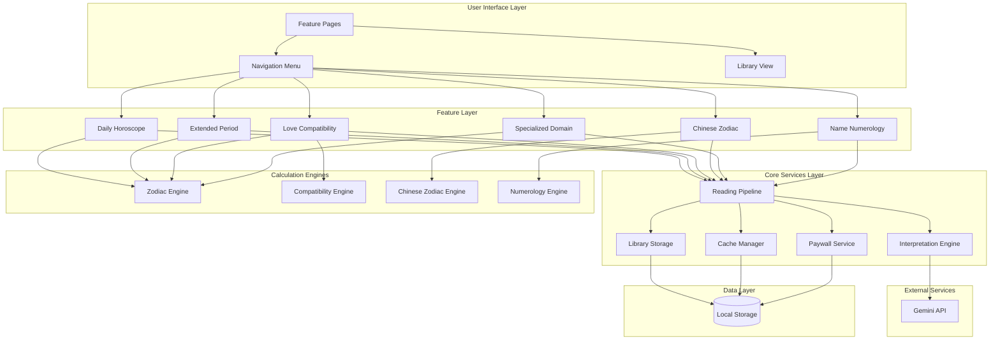

# Design Document: Popular Fortune Features

## Overview

This design document specifies the architecture and implementation approach for six new fortune-telling features in REFFORTUNE: Daily Horoscope, Extended Period Horoscopes, Love Compatibility, Chinese Zodiac Fortune, Specialized Domain Readings, and Name Numerology. These features expand the platform's divination offerings while maintaining consistency with existing patterns.

The design follows the established REFFORTUNE architecture pattern:
- **Deterministic baseline interpretations** for consistency and reliability
- **AI enhancement via Gemini API** for personalized, contextual guidance
- **Fast response times** (<5 seconds) through caching and efficient algorithms
- **Credit-based monetization** integrated at the feature level
- **Local storage** for privacy-preserving data persistence

All features share common infrastructure including the reading pipeline, interpretation engine, library storage, and paywall system. The design emphasizes code reusability through shared components and utilities.

## Architecture

### High-Level System Architecture



### Directory Structure

Following the existing REFFORTUNE structure:

```
src/
├── app/
│   ├── horoscope/
│   │   ├── page.tsx                    # Horoscope feature selection
│   │   ├── daily/
│   │   │   ├── page.tsx                # Daily horoscope input
│   │   │   └── result/page.tsx         # Daily horoscope result
│   │   ├── weekly/
│   │   │   └── result/page.tsx         # Weekly horoscope result
│   │   └── monthly/
│   │       └── result/page.tsx         # Monthly horoscope result
│   ├── compatibility/
│   │   ├── page.tsx                    # Love compatibility input
│   │   └── result/page.tsx             # Compatibility result
│   ├── chinese-zodiac/
│   │   ├── page.tsx                    # Chinese zodiac input
│   │   └── result/page.tsx             # Chinese zodiac result
│   ├── specialized/
│   │   ├── page.tsx                    # Domain selection
│   │   └── result/page.tsx             # Specialized reading result
│   ├── name-numerology/
│   │   ├── page.tsx                    # Name input
│   │   └── result/page.tsx             # Name numerology result
│   └── api/
│       └── ai/
│           ├── horoscope/route.ts      # Horoscope AI interpretation
│           ├── compatibility/route.ts   # Compatibility AI interpretation
│           ├── chinese-zodiac/route.ts # Chinese zodiac AI interpretation
│           └── name-numerology/route.ts # Name numerology AI interpretation
├── lib/
│   ├── horoscope/
│   │   ├── engine.ts                   # Horoscope generation logic
│   │   ├── zodiac.ts                   # Zodiac sign utilities
│   │   ├── baseline.ts                 # Baseline interpretations
│   │   └── types.ts                    # Horoscope types
│   ├── compatibility/
│   │   ├── engine.ts                   # Compatibility calculation
│   │   ├── scoring.ts                  # Compatibility scoring algorithm
│   │   ├── baseline.ts                 # Baseline compatibility texts
│   │   └── types.ts                    # Compatibility types
│   ├── chinese-zodiac/
│   │   ├── engine.ts                   # Chinese zodiac calculation
│   │   ├── animals.ts                  # Animal sign definitions
│   │   ├── baseline.ts                 # Baseline interpretations
│   │   └── types.ts                    # Chinese zodiac types
│   ├── name-numerology/
│   │   ├── engine.ts                   # Name numerology calculation
│   │   ├── thai-mapping.ts             # Thai character to number mapping
│   │   ├── baseline.ts                 # Baseline interpretations
│   │   └── types.ts                    # Name numerology types
│   └── reading/
│       └── pipeline.ts                 # Extended to support new features
└── components/
    ├── horoscope/
    │   ├── ZodiacSelector.tsx          # Zodiac sign selection UI
    │   └── PeriodSelector.tsx          # Time period selection UI
    ├── compatibility/
    │   └── DateInputPair.tsx           # Dual birth date input
    ├── chinese-zodiac/
    │   └── AnimalDisplay.tsx           # Chinese zodiac animal display
    └── name-numerology/
        └── ThaiNameInput.tsx           # Thai name input with validation
```

## Components and Interfaces

### 1. Zodiac Engine (`src/lib/horoscope/zodiac.ts`)

Handles Western zodiac sign calculations and utilities.

```typescript
// Zodiac sign enumeration
export enum ZodiacSign {
  ARIES = 'aries',
  TAURUS = 'taurus',
  GEMINI = 'gemini',
  CANCER = 'cancer',
  LEO = 'leo',
  VIRGO = 'virgo',
  LIBRA = 'libra',
  SCORPIO = 'scorpio',
  SAGITTARIUS = 'sagittarius',
  CAPRICORN = 'capricorn',
  AQUARIUS = 'aquarius',
  PISCES = 'pisces'
}

// Zodiac sign metadata
export interface ZodiacMetadata {
  sign: ZodiacSign;
  thaiName: string;
  element: 'fire' | 'earth' | 'air' | 'water';
  quality: 'cardinal' | 'fixed' | 'mutable';
  rulingPlanet: string;
  dateRange: { start: { month: number; day: number }; end: { month: number; day: number } };
  symbol: string;
  traits: string[];
}

// Calculate zodiac sign from birth date
export function calculateZodiacSign(birthDate: Date): ZodiacSign

// Get zodiac metadata
export function getZodiacMetadata(sign: ZodiacSign): ZodiacMetadata

// Get Thai name for zodiac sign
export function getZodiacThaiName(sign: ZodiacSign): string

// Get all zodiac signs with metadata
export function getAllZodiacSigns(): ZodiacMetadata[]
```

**Implementation Notes:**
- Date ranges follow standard Western astrology (Aries: Mar 21-Apr 19, etc.)
- Thai names use common Thai zodiac terminology (เมษ, พฤษภ, มิถุน, etc.)
- Element and quality used for compatibility calculations
- Traits provide baseline personality characteristics

### 2. Horoscope Engine (`src/lib/horoscope/engine.ts`)

Generates horoscope readings for different time periods.

```typescript
export enum TimePeriod {
  DAILY = 'daily',
  WEEKLY = 'weekly',
  MONTHLY = 'monthly'
}

export interface HoroscopeInput {
  zodiacSign: ZodiacSign;
  period: TimePeriod;
  date: Date; // Reference date for the reading
}

export interface HoroscopeReading {
  zodiacSign: ZodiacSign;
  period: TimePeriod;
  dateRange: { start: Date; end: Date };
  aspects: {
    love: string;
    career: string;
    finance: string;
    health: string;
  };
  luckyNumbers: number[];
  luckyColors: string[];
  advice: string;
  confidence: number; // 0-100, indicates baseline vs AI mix
}

// Generate horoscope reading
export function generateHoroscope(input: HoroscopeInput): Promise<HoroscopeReading>

// Get baseline horoscope (deterministic)
export function getBaselineHoroscope(input: HoroscopeInput): HoroscopeReading

// Calculate date range for period
export function calculateDateRange(date: Date, period: TimePeriod): { start: Date; end: Date }
```

**Implementation Notes:**
- Baseline horoscopes use seed-based randomization (zodiac + date) for consistency
- Daily horoscopes cached per zodiac sign per day
- Weekly horoscopes span Monday-Sunday of current week
- Monthly horoscopes span full calendar month
- Lucky numbers generated deterministically (1-99 range, 3-5 numbers)
- Lucky colors mapped from zodiac element and period

### 3. Compatibility Engine (`src/lib/compatibility/engine.ts`)

Calculates love compatibility between two people.

```typescript
export interface CompatibilityInput {
  person1: {
    birthDate: Date;
    zodiacSign?: ZodiacSign; // Auto-calculated if not provided
  };
  person2: {
    birthDate: Date;
    zodiacSign?: ZodiacSign;
  };
}

export interface CompatibilityReading {
  person1: {
    birthDate: Date;
    zodiacSign: ZodiacSign;
  };
  person2: {
    birthDate: Date;
    zodiacSign: ZodiacSign;
  };
  overallScore: number; // 0-100
  scores: {
    overall: number;
    communication: number;
    emotional: number;
    longTerm: number;
  };
  strengths: string[];
  challenges: string[];
  advice: string;
  elementCompatibility: string; // e.g., "Fire + Air = Harmonious"
}

// Calculate compatibility
export function calculateCompatibility(input: CompatibilityInput): Promise<CompatibilityReading>

// Get baseline compatibility (deterministic)
export function getBaselineCompatibility(input: CompatibilityInput): CompatibilityReading

// Calculate element compatibility score
export function calculateElementScore(sign1: ZodiacSign, sign2: ZodiacSign): number

// Calculate quality compatibility score
export function calculateQualityScore(sign1: ZodiacSign, sign2: ZodiacSign): number
```

**Implementation Notes:**
- Overall score combines element compatibility (40%), quality compatibility (30%), and sign-specific rules (30%)
- Element compatibility: Same element = 90-100, Compatible elements (Fire+Air, Earth+Water) = 70-85, Neutral = 50-65, Challenging = 30-45
- Quality compatibility: Same quality = 80-90, Compatible = 60-75, Challenging = 40-55
- Sign-specific rules handle traditional pairings (e.g., Aries-Leo, Taurus-Virgo)
- Scores are deterministic based on zodiac signs only
- AI enhancement adds personalized advice based on specific birth dates

### 4. Chinese Zodiac Engine (`src/lib/chinese-zodiac/engine.ts`)

Calculates Chinese zodiac animals and generates fortunes.

```typescript
export enum ChineseZodiacAnimal {
  RAT = 'rat',
  OX = 'ox',
  TIGER = 'tiger',
  RABBIT = 'rabbit',
  DRAGON = 'dragon',
  SNAKE = 'snake',
  HORSE = 'horse',
  GOAT = 'goat',
  MONKEY = 'monkey',
  ROOSTER = 'rooster',
  DOG = 'dog',
  PIG = 'pig'
}

export enum ChineseElement {
  WOOD = 'wood',
  FIRE = 'fire',
  EARTH = 'earth',
  METAL = 'metal',
  WATER = 'water'
}

export interface ChineseZodiacInput {
  birthYear: number;
  period: TimePeriod; // DAILY, WEEKLY, MONTHLY, or year
  date: Date;
}

export interface ChineseZodiacReading {
  animal: ChineseZodiacAnimal;
  element: ChineseElement;
  thaiName: string;
  chineseName: string;
  period: TimePeriod;
  dateRange: { start: Date; end: Date };
  fortune: {
    overall: string;
    career: string;
    wealth: string;
    health: string;
    relationships: string;
  };
  luckyColors: string[];
  luckyNumbers: number[];
  luckyDirections: string[];
  advice: string;
}

// Calculate Chinese zodiac animal from birth year
export function calculateChineseZodiac(birthYear: number): ChineseZodiacAnimal

// Calculate Chinese element from birth year
export function calculateChineseElement(birthYear: number): ChineseElement

// Generate Chinese zodiac reading
export function generateChineseZodiacReading(input: ChineseZodiacInput): Promise<ChineseZodiacReading>

// Get baseline Chinese zodiac reading
export function getBaselineChineseZodiacReading(input: ChineseZodiacInput): ChineseZodiacReading
```

**Implementation Notes:**
- Animal calculation: `(year - 4) % 12` maps to animal index
- Element calculation: `Math.floor((year - 4) % 10 / 2)` maps to element
- Thai names use common Thai terminology (ปีชวด, ปีฉลู, ปีขาล, etc.)
- Lucky colors derived from element (Wood=green, Fire=red, Earth=yellow, Metal=white, Water=black/blue)
- Lucky numbers use animal index and element for seed
- Lucky directions follow traditional Chinese feng shui (North, South, East, West, etc.)

### 5. Name Numerology Engine (`src/lib/name-numerology/engine.ts`)

Analyzes Thai names using numerology.

```typescript
export interface NameNumerologyInput {
  firstName: string; // Thai characters
  lastName: string; // Thai characters
}

export interface NameNumerologyReading {
  firstName: string;
  lastName: string;
  scores: {
    firstName: number; // 1-9
    lastName: number; // 1-9
    fullName: number; // 1-9
    destiny: number; // 1-9
  };
  interpretation: {
    personality: string;
    strengths: string[];
    weaknesses: string[];
    lifePath: string;
    career: string;
    relationships: string;
  };
  luckyNumbers: number[];
  advice: string;
}

// Calculate name numerology
export function calculateNameNumerology(input: NameNumerologyInput): Promise<NameNumerologyReading>

// Get baseline name numerology
export function getBaselineNameNumerology(input: NameNumerologyInput): NameNumerologyReading

// Convert Thai character to number
export function thaiCharToNumber(char: string): number

// Calculate name score (reduce to single digit)
export function calculateNameScore(name: string): number

// Validate Thai characters
export function isValidThaiName(name: string): boolean
```

**Implementation Notes:**
- Thai character mapping follows Pythagorean system adapted for Thai alphabet
- Consonants: ก=1, ข=2, ค=3, ง=4, จ=5, ฉ=6, ช=7, ซ=8, ฌ=9, ญ=1, etc. (cycling 1-9)
- Vowels: ะ=1, า=1, ิ=1, ี=2, ึ=3, ื=3, ุ=3, ู=6, เ=5, แ=5, โ=7, ใ=9, ไ=9
- Score calculation: Sum all character values, reduce to single digit (11 and 22 are master numbers, not reduced)
- Destiny number: (firstName score + lastName score) reduced to single digit
- Validation: Check for Thai Unicode range (U+0E00 to U+0E7F)

### 6. Specialized Domain Engine (`src/lib/horoscope/specialized.ts`)

Generates domain-specific horoscope readings.

```typescript
export enum ReadingDomain {
  FINANCE_CAREER = 'finance_career',
  LOVE_RELATIONSHIPS = 'love_relationships'
}

export interface SpecializedInput {
  zodiacSign: ZodiacSign;
  domain: ReadingDomain;
  period: TimePeriod;
  date: Date;
}

export interface SpecializedReading {
  zodiacSign: ZodiacSign;
  domain: ReadingDomain;
  period: TimePeriod;
  dateRange: { start: Date; end: Date };
  prediction: string;
  opportunities: string[];
  challenges: string[];
  actionItems: string[];
  advice: string;
}

// Generate specialized reading
export function generateSpecializedReading(input: SpecializedInput): Promise<SpecializedReading>

// Get baseline specialized reading
export function getBaselineSpecializedReading(input: SpecializedInput): SpecializedReading
```

**Implementation Notes:**
- Finance/Career domain focuses on: work opportunities, income prospects, professional relationships, career decisions
- Love/Relationships domain focuses on: romantic prospects, relationship harmony, emotional wellbeing, social connections
- Predictions more specific than general horoscopes
- Action items provide concrete steps (3-5 items)
- Uses same caching strategy as general horoscopes

### 7. Reading Pipeline Extension (`src/lib/reading/pipeline.ts`)

Extends existing pipeline to support new feature types.

```typescript
// Add new reading types
export enum ReadingType {
  // Existing types
  TAROT = 'tarot',
  SPIRIT_CARD = 'spirit_card',
  NUMEROLOGY = 'numerology',
  DAILY_CARD = 'daily_card',
  // New types
  HOROSCOPE = 'horoscope',
  COMPATIBILITY = 'compatibility',
  CHINESE_ZODIAC = 'chinese_zodiac',
  SPECIALIZED = 'specialized',
  NAME_NUMEROLOGY = 'name_numerology'
}

// Extended reading request
export interface ReadingRequest {
  type: ReadingType;
  input: any; // Type-specific input
  userId?: string; // Optional user identifier
}

// Extended reading result
export interface ReadingResult {
  type: ReadingType;
  timestamp: Date;
  data: any; // Type-specific result
  creditCost: number;
  cached: boolean;
}

// Process reading request
export async function processReading(request: ReadingRequest): Promise<ReadingResult>

// Get credit cost for reading type
export function getCreditCost(type: ReadingType, options?: any): number
```

**Implementation Notes:**
- Credit costs: Horoscope daily=1, weekly=2, monthly=3, Compatibility=2, Chinese Zodiac=1, Specialized=2, Name Numerology=2
- Pipeline orchestrates: input validation → paywall check → cache check → engine execution → AI enhancement → storage → result
- Cache keys include feature type, input parameters, and date
- First-time free reading tracked per feature type in local storage

### 8. Cache Manager (`src/lib/reading/cache.ts`)

New utility for caching horoscope readings.

```typescript
export interface CacheEntry<T> {
  key: string;
  data: T;
  timestamp: Date;
  expiresAt: Date;
}

export interface CacheOptions {
  ttl: number; // Time to live in milliseconds
  keyPrefix: string;
}

// Set cache entry
export function setCacheEntry<T>(key: string, data: T, options: CacheOptions): void

// Get cache entry
export function getCacheEntry<T>(key: string): T | null

// Check if cache entry is valid
export function isCacheValid(key: string): boolean

// Clear expired cache entries
export function clearExpiredCache(): void

// Clear all cache for a specific prefix
export function clearCacheByPrefix(prefix: string): void

// Generate cache key
export function generateCacheKey(type: ReadingType, params: any): string
```

**Implementation Notes:**
- Daily horoscopes: TTL = until end of day (midnight)
- Weekly horoscopes: TTL = until end of week (Sunday 23:59)
- Monthly horoscopes: TTL = until end of month
- Cache stored in local storage with prefix `fortune_cache_`
- Cache keys format: `{type}_{zodiacSign}_{period}_{date}`
- Automatic cleanup on page load removes expired entries

## Data Models

### Horoscope Data Model

```typescript
export interface HoroscopeData {
  id: string; // UUID
  type: 'horoscope';
  zodiacSign: ZodiacSign;
  period: TimePeriod;
  dateRange: {
    start: string; // ISO date
    end: string; // ISO date
  };
  aspects: {
    love: string;
    career: string;
    finance: string;
    health: string;
  };
  luckyNumbers: number[];
  luckyColors: string[];
  advice: string;
  aiEnhanced: boolean;
  createdAt: string; // ISO timestamp
}
```

### Compatibility Data Model

```typescript
export interface CompatibilityData {
  id: string;
  type: 'compatibility';
  person1: {
    birthDate: string; // ISO date
    zodiacSign: ZodiacSign;
  };
  person2: {
    birthDate: string;
    zodiacSign: ZodiacSign;
  };
  scores: {
    overall: number;
    communication: number;
    emotional: number;
    longTerm: number;
  };
  strengths: string[];
  challenges: string[];
  advice: string;
  elementCompatibility: string;
  aiEnhanced: boolean;
  createdAt: string;
}
```

### Chinese Zodiac Data Model

```typescript
export interface ChineseZodiacData {
  id: string;
  type: 'chinese_zodiac';
  animal: ChineseZodiacAnimal;
  element: ChineseElement;
  period: TimePeriod;
  dateRange: {
    start: string;
    end: string;
  };
  fortune: {
    overall: string;
    career: string;
    wealth: string;
    health: string;
    relationships: string;
  };
  luckyColors: string[];
  luckyNumbers: number[];
  luckyDirections: string[];
  advice: string;
  aiEnhanced: boolean;
  createdAt: string;
}
```

### Name Numerology Data Model

```typescript
export interface NameNumerologyData {
  id: string;
  type: 'name_numerology';
  firstName: string;
  lastName: string;
  scores: {
    firstName: number;
    lastName: number;
    fullName: number;
    destiny: number;
  };
  interpretation: {
    personality: string;
    strengths: string[];
    weaknesses: string[];
    lifePath: string;
    career: string;
    relationships: string;
  };
  luckyNumbers: number[];
  advice: string;
  aiEnhanced: boolean;
  createdAt: string;
}
```

### Specialized Reading Data Model

```typescript
export interface SpecializedData {
  id: string;
  type: 'specialized';
  zodiacSign: ZodiacSign;
  domain: ReadingDomain;
  period: TimePeriod;
  dateRange: {
    start: string;
    end: string;
  };
  prediction: string;
  opportunities: string[];
  challenges: string[];
  actionItems: string[];
  advice: string;
  aiEnhanced: boolean;
  createdAt: string;
}
```

### Library Storage Schema

Extends existing library storage to support new reading types:

```typescript
export interface LibraryEntry {
  id: string;
  type: ReadingType;
  data: HoroscopeData | CompatibilityData | ChineseZodiacData | NameNumerologyData | SpecializedData | any;
  preview: string; // Short text for list view
  createdAt: string;
  favorite: boolean;
}

export interface Library {
  entries: LibraryEntry[];
  maxEntries: number; // 50
  lastUpdated: string;
}
```

**Storage Key:** `fortune_library`

**Implementation Notes:**
- Preview generated from first 100 characters of main interpretation
- Entries sorted by createdAt descending (newest first)
- When limit exceeded, oldest non-favorite entry removed
- Favorite flag prevents automatic removal


## Correctness Properties

*A property is a characteristic or behavior that should hold true across all valid executions of a system—essentially, a formal statement about what the system should do. Properties serve as the bridge between human-readable specifications and machine-verifiable correctness guarantees.*

### Property 1: Horoscope Generation Completeness

*For any* zodiac sign and date, when generating a horoscope, the system should produce a reading containing all four aspects (love, career, finance, health), lucky numbers, lucky colors, and advice.

**Validates: Requirements 1.2, 1.4**

### Property 2: Date Range Calculation Correctness

*For any* date and time period (daily, weekly, monthly), the calculated date range should span the correct period: daily = single day, weekly = Monday to Sunday of that week, monthly = first to last day of that calendar month.

**Validates: Requirements 2.2, 2.3, 2.5**

### Property 3: Horoscope Cache Consistency

*For any* zodiac sign and date, requesting a horoscope multiple times on the same date should return identical content (cache hit), but requesting on different dates should return different content (cache invalidation).

**Validates: Requirements 1.5, 10.3, 10.4, 10.5**

### Property 4: Reading History Persistence

*For any* completed reading, the reading should appear in Reading_History with timestamp, feature type, and complete data, and should remain retrievable until explicitly deleted or evicted by the 50-entry limit.

**Validates: Requirements 1.8, 3.7, 8.1, 8.5**

### Property 5: Compatibility Score Bounds

*For any* two birth dates, the calculated compatibility score should be a number between 0 and 100 (inclusive).

**Validates: Requirements 3.2**

### Property 6: Compatibility Score Determinism

*For any* two zodiac signs, calculating compatibility multiple times should always produce the same overall score and sub-scores (communication, emotional, long-term).

**Validates: Requirements 3.6**

### Property 7: Zodiac Sign Calculation Correctness

*For any* birth date, the derived zodiac sign should match the expected sign based on the date's position in the zodiac calendar (Aries: Mar 21-Apr 19, Taurus: Apr 20-May 20, etc.).

**Validates: Requirements 3.3**

### Property 8: Compatibility Output Completeness

*For any* compatibility reading, the result should contain all four score categories (overall, communication, emotional, long-term), strengths array, challenges array, and advice.

**Validates: Requirements 3.4, 3.5**

### Property 9: Chinese Zodiac Calculation Correctness

*For any* birth year, the calculated Chinese zodiac animal should match the expected animal based on the formula: (year - 4) % 12, and the element should match the expected element based on: floor((year - 4) % 10 / 2).

**Validates: Requirements 4.2**

### Property 10: Chinese Zodiac Output Completeness

*For any* Chinese zodiac reading, the result should contain fortune sections (overall, career, wealth, health, relationships), lucky colors, lucky numbers, and lucky directions.

**Validates: Requirements 4.5**

### Property 11: Thai Name Validation

*For any* input string, the name validation should accept strings containing only Thai characters (Unicode range U+0E00 to U+0E7F and spaces) and reject strings containing any other characters.

**Validates: Requirements 6.6, 6.7**

### Property 12: Name Score Calculation Structure

*For any* valid Thai name pair (first name and surname), the calculated result should contain four separate scores: firstName score, lastName score, fullName score, and destiny score, each in the range 1-9 (or 11, 22 for master numbers).

**Validates: Requirements 6.2, 6.4**

### Property 13: Thai Character to Number Mapping Consistency

*For any* Thai character in the defined mapping, converting the character to a number should always return the same number value, and the value should be in the range 1-9.

**Validates: Requirements 6.3**

### Property 14: Name Numerology Output Completeness

*For any* name numerology reading, the interpretation should contain personality description, strengths array, weaknesses array, life path description, career guidance, and relationships guidance.

**Validates: Requirements 6.5**

### Property 15: Credit Cost Consistency

*For any* reading type and options, the credit cost should match the defined costs: daily horoscope = 1, weekly = 2, monthly = 3, compatibility = 2, Chinese zodiac = 1, specialized = 2, name numerology = 2.

**Validates: Requirements 7.2**

### Property 16: Credit Deduction Correctness

*For any* completed reading, if the user had N credits before the reading and the reading costs C credits, the user should have N - C credits after the reading.

**Validates: Requirements 7.4**

### Property 17: First Reading Free Policy

*For any* feature type, the first reading should not deduct credits, but the second reading of the same type should deduct the appropriate number of credits.

**Validates: Requirements 7.5**

### Property 18: Reading History Size Limit

*For any* sequence of readings, the Reading_History should never contain more than 50 entries, and when the 51st reading is added, the oldest (earliest timestamp) non-favorite reading should be removed.

**Validates: Requirements 8.2, 8.3**

### Property 19: Reading History Organization

*For any* set of saved readings, when displayed in the library view, readings should be grouped by feature type and each entry should display date, feature type, and preview text.

**Validates: Requirements 8.4, 8.7**

### Property 20: Reading Deletion Completeness

*For any* reading in Reading_History, after deleting that reading, it should not appear in subsequent library queries and the history count should decrease by one.

**Validates: Requirements 8.6**

### Property 21: Paywall Evaluation Trigger

*For any* feature access attempt, the paywall should evaluate credit requirements before allowing the reading to proceed.

**Validates: Requirements 7.1**

### Property 22: Insufficient Credits Handling

*For any* reading request where the user has fewer credits than required (and has already used their free reading for that feature type), the system should display a credit purchase prompt and not generate the reading.

**Validates: Requirements 7.3**

### Property 23: API Fallback Behavior

*For any* reading generation, if the Gemini API call fails or times out, the system should return a baseline interpretation without AI enhancement rather than failing completely.

**Validates: Requirements 10.2**

### Property 24: AI Response Validation

*For any* AI-generated response, the system should validate that the response is non-empty and contains at least 100 Thai characters, and if validation fails, should retry once before falling back to baseline.

**Validates: Requirements 11.4, 11.5**

### Property 25: AI Request Context Completeness

*For any* Gemini API call, the request should include context parameters: feature type, zodiac sign (if applicable), time period (if applicable), and language specification (Thai).

**Validates: Requirements 11.1, 11.3**

### Property 26: Output Structure with AI Enhancement

*For any* reading that includes AI enhancement, the output should clearly indicate which sections are baseline (deterministic) and which are AI-generated, with confidence indicators.

**Validates: Requirements 1.3, 11.6, 11.7**

### Property 27: Thai Language Output

*For any* reading output (horoscope, compatibility, Chinese zodiac, name numerology, specialized), all text content should be in Thai language (contain Thai characters).

**Validates: Requirements 1.7, 4.6, 9.6**

### Property 28: Error Message Localization

*For any* error condition during reading generation, the displayed error message should be in Thai language and should not expose technical implementation details.

**Validates: Requirements 10.6, 10.7**

### Property 29: Local Storage Only Policy

*For any* user data storage operation (readings, personal information, cache), the data should be stored in browser local storage and no HTTP requests should be made to external storage services (except Gemini API for interpretation).

**Validates: Requirements 12.1, 12.2**

### Property 30: Data Clearing Completeness

*For any* user-initiated data clear operation, all local storage keys related to the fortune system (readings, cache, personal data, free reading flags) should be removed.

**Validates: Requirements 12.3, 12.4**

### Property 31: Period Maintenance Across UI Changes

*For any* horoscope session, when switching between time periods (daily, weekly, monthly), the selected zodiac sign should remain unchanged.

**Validates: Requirements 2.6**

### Property 32: Navigation Menu Presence

*For any* fortune feature page (horoscope, compatibility, Chinese zodiac, specialized, name numerology), a navigation menu providing access to other features should be present in the UI.

**Validates: Requirements 9.2**

### Property 33: FAB Presence on Feature Pages

*For any* fortune feature page, a floating action button (FAB) with LINE add CTA should be present in the UI.

**Validates: Requirements 9.4**

### Property 34: Post-Reading Options Completeness

*For any* completed reading result page, the UI should offer three options: view another reading, share results, and return to feature selection.

**Validates: Requirements 9.5**

### Property 35: Privacy Notice on First Use

*For any* feature type, on the first use of that feature (tracked per feature type), a privacy notice explaining data storage practices should be displayed.

**Validates: Requirements 12.6**

### Property 36: Cookie Absence

*For any* user session, the system should not set any cookies for tracking purposes (no document.cookie writes).

**Validates: Requirements 12.5**

## Error Handling

### Error Categories

1. **Input Validation Errors**
   - Invalid zodiac sign selection
   - Invalid birth date format or out-of-range dates
   - Invalid Thai name characters
   - Missing required fields

2. **API Errors**
   - Gemini API unavailable or timeout
   - API response validation failure
   - Rate limiting or quota exceeded

3. **Storage Errors**
   - Local storage quota exceeded
   - Local storage access denied (privacy mode)
   - Corrupted data in storage

4. **Calculation Errors**
   - Unexpected null/undefined values
   - Date calculation edge cases (leap years, month boundaries)
   - Numeric overflow in score calculations

### Error Handling Strategies

#### Input Validation

```typescript
// Validate zodiac sign
function validateZodiacSign(sign: string): Result<ZodiacSign, ValidationError> {
  if (!Object.values(ZodiacSign).includes(sign as ZodiacSign)) {
    return Err({
      code: 'INVALID_ZODIAC_SIGN',
      message: 'ราศีที่เลือกไม่ถูกต้อง กรุณาเลือกราศีที่ถูกต้อง',
      field: 'zodiacSign'
    });
  }
  return Ok(sign as ZodiacSign);
}

// Validate birth date
function validateBirthDate(date: Date): Result<Date, ValidationError> {
  const now = new Date();
  const minDate = new Date('1900-01-01');
  
  if (isNaN(date.getTime())) {
    return Err({
      code: 'INVALID_DATE_FORMAT',
      message: 'รูปแบบวันที่ไม่ถูกต้อง กรุณาระบุวันที่ในรูปแบบที่ถูกต้อง',
      field: 'birthDate'
    });
  }
  
  if (date > now) {
    return Err({
      code: 'FUTURE_DATE',
      message: 'ไม่สามารถใช้วันที่ในอนาคตได้',
      field: 'birthDate'
    });
  }
  
  if (date < minDate) {
    return Err({
      code: 'DATE_TOO_OLD',
      message: 'วันที่ต้องไม่เก่ากว่าปี ค.ศ. 1900',
      field: 'birthDate'
    });
  }
  
  return Ok(date);
}

// Validate Thai name
function validateThaiName(name: string): Result<string, ValidationError> {
  const thaiCharRegex = /^[\u0E00-\u0E7F\s]+$/;
  
  if (!name || name.trim().length === 0) {
    return Err({
      code: 'EMPTY_NAME',
      message: 'กรุณาระบุชื่อ',
      field: 'name'
    });
  }
  
  if (!thaiCharRegex.test(name)) {
    return Err({
      code: 'INVALID_THAI_CHARACTERS',
      message: 'กรุณาใช้ตัวอักษรไทยเท่านั้น',
      field: 'name'
    });
  }
  
  return Ok(name.trim());
}
```

#### API Error Handling

```typescript
async function callGeminiAPI(prompt: string, retries: number = 1): Promise<Result<string, APIError>> {
  try {
    const response = await fetch('/api/ai/horoscope', {
      method: 'POST',
      headers: { 'Content-Type': 'application/json' },
      body: JSON.stringify({ prompt }),
      signal: AbortSignal.timeout(10000) // 10 second timeout
    });
    
    if (!response.ok) {
      if (response.status === 429) {
        return Err({
          code: 'RATE_LIMIT_EXCEEDED',
          message: 'ขณะนี้มีผู้ใช้งานจำนวนมาก กรุณาลองใหม่อีกครั้งในอีกสักครู่',
          retryable: true
        });
      }
      
      throw new Error(`API error: ${response.status}`);
    }
    
    const data = await response.json();
    
    // Validate response
    if (!data.interpretation || data.interpretation.length < 100) {
      if (retries > 0) {
        // Retry once
        return callGeminiAPI(prompt, retries - 1);
      }
      
      return Err({
        code: 'INVALID_API_RESPONSE',
        message: 'ไม่สามารถสร้างคำทำนายได้ กรุณาลองใหม่อีกครั้ง',
        retryable: false
      });
    }
    
    return Ok(data.interpretation);
    
  } catch (error) {
    if (error.name === 'AbortError') {
      return Err({
        code: 'API_TIMEOUT',
        message: 'การเชื่อมต่อใช้เวลานานเกินไป กรุณาลองใหม่อีกครั้ง',
        retryable: true
      });
    }
    
    // Network error or API unavailable - fall back to baseline
    return Err({
      code: 'API_UNAVAILABLE',
      message: 'ไม่สามารถเชื่อมต่อกับระบบได้ กำลังใช้คำทำนายพื้นฐาน',
      retryable: false,
      fallbackAvailable: true
    });
  }
}

// Wrapper with fallback
async function generateWithAI(baseline: string, prompt: string): Promise<string> {
  const result = await callGeminiAPI(prompt);
  
  if (result.isOk()) {
    return result.value;
  }
  
  // Log error for debugging
  console.error('AI generation failed:', result.error);
  
  // Return baseline interpretation
  return baseline;
}
```

#### Storage Error Handling

```typescript
function saveToLocalStorage<T>(key: string, data: T): Result<void, StorageError> {
  try {
    const serialized = JSON.stringify(data);
    localStorage.setItem(key, serialized);
    return Ok(undefined);
    
  } catch (error) {
    if (error.name === 'QuotaExceededError') {
      // Try to clear old cache entries
      clearExpiredCache();
      
      // Retry once
      try {
        localStorage.setItem(key, JSON.stringify(data));
        return Ok(undefined);
      } catch {
        return Err({
          code: 'STORAGE_QUOTA_EXCEEDED',
          message: 'พื้นที่จัดเก็บข้อมูลเต็ม กรุณาลบประวัติการดูดวงเก่าออกบางส่วน',
          recoverable: true
        });
      }
    }
    
    if (error.name === 'SecurityError') {
      return Err({
        code: 'STORAGE_ACCESS_DENIED',
        message: 'ไม่สามารถบันทึกข้อมูลได้ กรุณาตรวจสอบการตั้งค่าความเป็นส่วนตัวของเบราว์เซอร์',
        recoverable: false
      });
    }
    
    return Err({
      code: 'STORAGE_ERROR',
      message: 'เกิดข้อผิดพลาดในการบันทึกข้อมูล',
      recoverable: false
    });
  }
}

function loadFromLocalStorage<T>(key: string): Result<T | null, StorageError> {
  try {
    const item = localStorage.getItem(key);
    if (!item) {
      return Ok(null);
    }
    
    const parsed = JSON.parse(item);
    return Ok(parsed as T);
    
  } catch (error) {
    // Corrupted data - remove it
    try {
      localStorage.removeItem(key);
    } catch {
      // Ignore removal errors
    }
    
    return Err({
      code: 'CORRUPTED_DATA',
      message: 'ข้อมูลที่บันทึกไว้เสียหาย',
      recoverable: true
    });
  }
}
```

### Error Display Strategy

All errors displayed to users should:
1. Be in Thai language
2. Be actionable (tell user what to do)
3. Not expose technical details
4. Provide context about what went wrong
5. Offer recovery options when possible

Example error UI component:

```typescript
interface ErrorDisplayProps {
  error: ValidationError | APIError | StorageError;
  onRetry?: () => void;
  onDismiss?: () => void;
}

function ErrorDisplay({ error, onRetry, onDismiss }: ErrorDisplayProps) {
  return (
    <Alert variant="error">
      <AlertIcon />
      <AlertTitle>เกิดข้อผิดพลาด</AlertTitle>
      <AlertDescription>{error.message}</AlertDescription>
      <AlertActions>
        {error.retryable && onRetry && (
          <Button onClick={onRetry}>ลองอีกครั้ง</Button>
        )}
        {onDismiss && (
          <Button variant="ghost" onClick={onDismiss}>ปิด</Button>
        )}
      </AlertActions>
    </Alert>
  );
}
```

## Testing Strategy

### Dual Testing Approach

This feature requires both unit testing and property-based testing to ensure comprehensive coverage:

- **Unit tests**: Verify specific examples, edge cases, and error conditions
- **Property tests**: Verify universal properties across all inputs

Both testing approaches are complementary and necessary. Unit tests catch concrete bugs in specific scenarios, while property tests verify general correctness across a wide range of inputs.

### Property-Based Testing Configuration

**Library Selection**: Use `fast-check` for TypeScript/JavaScript property-based testing

**Configuration**:
- Minimum 100 iterations per property test (due to randomization)
- Each property test must reference its design document property
- Tag format: `// Feature: popular-fortune-features, Property {number}: {property_text}`

**Example Property Test**:

```typescript
import fc from 'fast-check';

// Feature: popular-fortune-features, Property 7: Zodiac Sign Calculation Correctness
describe('Zodiac Sign Calculation', () => {
  it('should calculate correct zodiac sign for any birth date', () => {
    fc.assert(
      fc.property(
        fc.date({ min: new Date('1900-01-01'), max: new Date() }),
        (birthDate) => {
          const zodiacSign = calculateZodiacSign(birthDate);
          const expected = getExpectedZodiacSign(birthDate);
          expect(zodiacSign).toBe(expected);
        }
      ),
      { numRuns: 100 }
    );
  });
});

// Feature: popular-fortune-features, Property 6: Compatibility Score Determinism
describe('Compatibility Score Determinism', () => {
  it('should produce same score for same zodiac pair', () => {
    fc.assert(
      fc.property(
        fc.constantFrom(...Object.values(ZodiacSign)),
        fc.constantFrom(...Object.values(ZodiacSign)),
        (sign1, sign2) => {
          const score1 = calculateCompatibility({
            person1: { birthDate: new Date(), zodiacSign: sign1 },
            person2: { birthDate: new Date(), zodiacSign: sign2 }
          });
          
          const score2 = calculateCompatibility({
            person1: { birthDate: new Date(), zodiacSign: sign1 },
            person2: { birthDate: new Date(), zodiacSign: sign2 }
          });
          
          expect(score1.overallScore).toBe(score2.overallScore);
          expect(score1.scores).toEqual(score2.scores);
        }
      ),
      { numRuns: 100 }
    );
  });
});

// Feature: popular-fortune-features, Property 11: Thai Name Validation
describe('Thai Name Validation', () => {
  it('should accept only Thai characters and spaces', () => {
    fc.assert(
      fc.property(
        fc.string(),
        (input) => {
          const result = isValidThaiName(input);
          const hasOnlyThaiChars = /^[\u0E00-\u0E7F\s]*$/.test(input);
          const hasContent = input.trim().length > 0;
          
          expect(result).toBe(hasOnlyThaiChars && hasContent);
        }
      ),
      { numRuns: 100 }
    );
  });
});
```

### Unit Testing Strategy

Unit tests should focus on:

1. **Specific Examples**: Test known zodiac sign boundaries, specific compatibility pairs, known Chinese zodiac years
2. **Edge Cases**: Leap years, month boundaries, year boundaries, empty inputs, maximum values
3. **Error Conditions**: Invalid inputs, API failures, storage errors
4. **Integration Points**: Component interactions, API request/response format, storage format

**Example Unit Tests**:

```typescript
describe('Zodiac Sign Calculation - Edge Cases', () => {
  it('should handle zodiac sign boundary dates correctly', () => {
    // Aries starts March 21
    expect(calculateZodiacSign(new Date('2024-03-20'))).toBe(ZodiacSign.PISCES);
    expect(calculateZodiacSign(new Date('2024-03-21'))).toBe(ZodiacSign.ARIES);
    
    // Taurus starts April 20
    expect(calculateZodiacSign(new Date('2024-04-19'))).toBe(ZodiacSign.ARIES);
    expect(calculateZodiacSign(new Date('2024-04-20'))).toBe(ZodiacSign.TAURUS);
  });
  
  it('should handle leap year dates', () => {
    expect(calculateZodiacSign(new Date('2024-02-29'))).toBe(ZodiacSign.PISCES);
  });
});

describe('Chinese Zodiac Calculation - Specific Years', () => {
  it('should calculate correct animal for known years', () => {
    expect(calculateChineseZodiac(2024)).toBe(ChineseZodiacAnimal.DRAGON);
    expect(calculateChineseZodiac(2025)).toBe(ChineseZodiacAnimal.SNAKE);
    expect(calculateChineseZodiac(2020)).toBe(ChineseZodiacAnimal.RAT);
  });
});

describe('Name Numerology - Thai Characters', () => {
  it('should calculate correct score for known Thai names', () => {
    const result = calculateNameScore('สมชาย'); // Known test case
    expect(result).toBe(7); // Expected value based on mapping
  });
  
  it('should reject names with English characters', () => {
    expect(isValidThaiName('John')).toBe(false);
    expect(isValidThaiName('สมชาย Smith')).toBe(false);
  });
  
  it('should accept names with Thai characters and spaces', () => {
    expect(isValidThaiName('สม ชาย')).toBe(true);
    expect(isValidThaiName('นางสาว สมหญิง')).toBe(true);
  });
});

describe('Reading History - Size Limit', () => {
  it('should remove oldest reading when exceeding 50 entries', () => {
    const library = createEmptyLibrary();
    
    // Add 51 readings
    for (let i = 0; i < 51; i++) {
      addReading(library, createMockReading({ timestamp: new Date(2024, 0, i + 1) }));
    }
    
    expect(library.entries.length).toBe(50);
    expect(library.entries[0].createdAt).not.toBe('2024-01-01'); // Oldest removed
  });
  
  it('should not remove favorite readings when at limit', () => {
    const library = createEmptyLibrary();
    
    // Add 50 readings, mark first as favorite
    const favoriteReading = createMockReading({ timestamp: new Date(2024, 0, 1) });
    favoriteReading.favorite = true;
    addReading(library, favoriteReading);
    
    for (let i = 1; i < 50; i++) {
      addReading(library, createMockReading({ timestamp: new Date(2024, 0, i + 1) }));
    }
    
    // Add 51st reading
    addReading(library, createMockReading({ timestamp: new Date(2024, 0, 52) }));
    
    expect(library.entries.length).toBe(50);
    expect(library.entries.find(e => e.id === favoriteReading.id)).toBeDefined();
  });
});

describe('Cache Invalidation', () => {
  it('should invalidate daily horoscope cache on date change', () => {
    const cache = createCache();
    const reading = createMockHoroscope();
    
    setCacheEntry('horoscope_aries_daily_2024-01-01', reading, {
      ttl: getMillisecondsUntilEndOfDay(new Date('2024-01-01')),
      keyPrefix: 'horoscope'
    });
    
    // Simulate date change
    jest.setSystemTime(new Date('2024-01-02'));
    
    expect(isCacheValid('horoscope_aries_daily_2024-01-01')).toBe(false);
  });
});

describe('API Fallback', () => {
  it('should return baseline interpretation when API fails', async () => {
    // Mock API failure
    jest.spyOn(global, 'fetch').mockRejectedValue(new Error('Network error'));
    
    const result = await generateHoroscope({
      zodiacSign: ZodiacSign.ARIES,
      period: TimePeriod.DAILY,
      date: new Date()
    });
    
    expect(result).toBeDefined();
    expect(result.advice).toBeTruthy(); // Should have baseline content
  });
});
```

### Test Coverage Goals

- **Line coverage**: Minimum 80%
- **Branch coverage**: Minimum 75%
- **Function coverage**: Minimum 85%
- **Property test coverage**: All 36 correctness properties must have corresponding property tests

### Testing Tools

- **Test Runner**: Jest
- **Property Testing**: fast-check
- **React Testing**: React Testing Library
- **API Mocking**: MSW (Mock Service Worker)
- **Date Mocking**: jest.setSystemTime()

### Continuous Integration

All tests must pass before merging:
1. Run unit tests: `npm test`
2. Run property tests: `npm test -- --testNamePattern="Property"`
3. Check coverage: `npm test -- --coverage`
4. Lint code: `npm run lint`
5. Type check: `npx tsc --noEmit`

