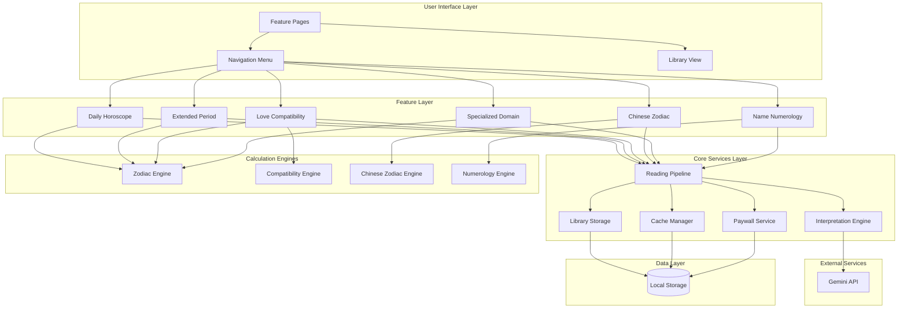

# Design Document: Popular Fortune Features

## Overview

This design document specifies the architecture and implementation approach for six new fortune-telling features in REFFORTUNE: Daily Horoscope, Extended Period Horoscopes, Love Compatibility, Chinese Zodiac Fortune, Specialized Domain Readings, and Name Numerology. These features expand the platform's divination offerings while maintaining consistency with existing patterns.

The design follows the established REFFORTUNE architecture pattern:
- **Deterministic baseline interpretations** for consistency and reliability
- **AI enhancement via Gemini API** for personalized, contextual guidance
- **Fast response times** (<5 seconds) through caching and efficient algorithms
- **Credit-based monetization** integrated at the feature level
- **Local storage** for privacy-preserving data persistence

All features share common infrastructure including the reading pipeline, interpretation engine, library storage, and paywall system. The design emphasizes code reusability through shared components and utilities.

## Architecture

### High-Level System Architecture



### Directory Structure

Following the existing REFFORTUNE structure:

```
src/
├── app/
│   ├── horoscope/
│   │   ├── page.tsx                    # Horoscope feature selection
│   │   ├── daily/
│   │   │   ├── page.tsx                # Daily horoscope input
│   │   │   └── result/page.tsx         # Daily horoscope result
│   │   ├── weekly/
│   │   │   └── result/page.tsx         # Weekly horoscope result
│   │   └── monthly/
│   │       └── result/page.tsx         # Monthly horoscope result
│   ├── compatibility/
│   │   ├── page.tsx                    # Love compatibility input
│   │   └── result/page.tsx             # Compatibility result
│   ├── chinese-zodiac/
│   │   ├── page.tsx                    # Chinese zodiac input
│   │   └── result/page.tsx             # Chinese zodiac result
│   ├── specialized/
│   │   ├── page.tsx                    # Domain selection
│   │   └── result/page.tsx             # Specialized reading result
│   ├── name-numerology/
│   │   ├── page.tsx                    # Name input
│   │   └── result/page.tsx             # Name numerology result
│   └── api/
│       └── ai/
│           ├── horoscope/route.ts      # Horoscope AI interpretation
│           ├── compatibility/route.ts   # Compatibility AI interpretation
│           ├── chinese-zodiac/route.ts # Chinese zodiac AI interpretation
│           └── name-numerology/route.ts # Name numerology AI interpretation
├── lib/
│   ├── horoscope/
│   │   ├── engine.ts                   # Horoscope generation logic
│   │   ├── zodiac.ts                   # Zodiac sign utilities
│   │   ├── baseline.ts                 # Baseline interpretations
│   │   └── types.ts                    # Horoscope types
│   ├── compatibility/
│   │   ├── engine.ts                   # Compatibility calculation
│   │   ├── scoring.ts                  # Compatibility scoring algorithm
│   │   ├── baseline.ts                 # Baseline compatibility texts
│   │   └── types.ts                    # Compatibility types
│   ├── chinese-zodiac/
│   │   ├── engine.ts                   # Chinese zodiac calculation
│   │   ├── animals.ts                  # Animal sign definitions
│   │   ├── baseline.ts                 # Baseline interpretations
│   │   └── types.ts                    # Chinese zodiac types
│   ├── name-numerology/
│   │   ├── engine.ts                   # Name numerology calculation
│   │   ├── thai-mapping.ts             # Thai character to number mapping
│   │   ├── baseline.ts                 # Baseline interpretations
│   │   └── types.ts                    # Name numerology types
│   └── reading/
│       └── pipeline.ts                 # Extended to support new features
└── components/
    ├── horoscope/
    │   ├── ZodiacSelector.tsx          # Zodiac sign selection UI
    │   └── PeriodSelector.tsx          # Time period selection UI
    ├── compatibility/
    │   └── DateInputPair.tsx           # Dual birth date input
    ├── chinese-zodiac/
    │   └── AnimalDisplay.tsx           # Chinese zodiac animal display
    └── name-numerology/
        └── ThaiNameInput.tsx           # Thai name input with validation
```

## Components and Interfaces

### 1. Zodiac Engine (`src/lib/horoscope/zodiac.ts`)

Handles Western zodiac sign calculations and utilities.

```typescript
// Zodiac sign enumeration
export enum ZodiacSign {
  ARIES = 'aries',
  TAURUS = 'taurus',
  GEMINI = 'gemini',
  CANCER = 'cancer',
  LEO = 'leo',
  VIRGO = 'virgo',
  LIBRA = 'libra',
  SCORPIO = 'scorpio',
  SAGITTARIUS = 'sagittarius',
  CAPRICORN = 'capricorn',
  AQUARIUS = 'aquarius',
  PISCES = 'pisces'
}

// Zodiac sign metadata
export interface ZodiacMetadata {
  sign: ZodiacSign;
  thaiName: string;
  element: 'fire' | 'earth' | 'air' | 'water';
  quality: 'cardinal' | 'fixed' | 'mutable';
  rulingPlanet: string;
  dateRange: { start: { month: number; day: number }; end: { month: number; day: number } };
  symbol: string;
  traits: string[];
}

// Calculate zodiac sign from birth date
export function calculateZodiacSign(birthDate: Date): ZodiacSign

// Get zodiac metadata
export function getZodiacMetadata(sign: ZodiacSign): ZodiacMetadata

// Get Thai name for zodiac sign
export function getZodiacThaiName(sign: ZodiacSign): string

// Get all zodiac signs with metadata
export function getAllZodiacSigns(): ZodiacMetadata[]
```

**Implementation Notes:**
- Date ranges follow standard Western astrology (Aries: Mar 21-Apr 19, etc.)
- Thai names use common Thai zodiac terminology (เมษ, พฤษภ, มิถุน, etc.)
- Element and quality used for compatibility calculations
- Traits provide baseline personality characteristics

### 2. Horoscope Engine (`src/lib/horoscope/engine.ts`)

Generates horoscope readings for different time periods.

```typescript
export enum TimePeriod {
  DAILY = 'daily',
  WEEKLY = 'weekly',
  MONTHLY = 'monthly'
}

export interface HoroscopeInput {
  zodiacSign: ZodiacSign;
  period: TimePeriod;
  date: Date; // Reference date for the reading
}

export interface HoroscopeReading {
  zodiacSign: ZodiacSign;
  period: TimePeriod;
  dateRange: { start: Date; end: Date };
  aspects: {
    love: string;
    career: string;
    finance: string;
    health: string;
  };
  luckyNumbers: number[];
  luckyColors: string[];
  advice: string;
  confidence: number; // 0-100, indicates baseline vs AI mix
}

// Generate horoscope reading
export function generateHoroscope(input: HoroscopeInput): Promise<HoroscopeReading>

// Get baseline horoscope (deterministic)
export function getBaselineHoroscope(input: HoroscopeInput): HoroscopeReading

// Calculate date range for period
export function calculateDateRange(date: Date, period: TimePeriod): { start: Date; end: Date }
```

**Implementation Notes:**
- Baseline horoscopes use seed-based randomization (zodiac + date) for consistency
- Daily horoscopes cached per zodiac sign per day
- Weekly horoscopes span Monday-Sunday of current week
- Monthly horoscopes span full calendar month
- Lucky numbers generated deterministically (1-99 range, 3-5 numbers)
- Lucky colors mapped from zodiac element and period

### 3. Compatibility Engine (`src/lib/compatibility/engine.ts`)

Calculates love compatibility between two people.

```typescript
export interface CompatibilityInput {
  person1: {
    birthDate: Date;
    zodiacSign?: ZodiacSign; // Auto-calculated if not provided
  };
  person2: {
    birthDate: Date;
    zodiacSign?: ZodiacSign;
  };
}

export interface CompatibilityReading {
  person1: {
    birthDate: Date;
    zodiacSign: ZodiacSign;
  };
  person2: {
    birthDate: Date;
    zodiacSign: ZodiacSign;
  };
  overallScore: number; // 0-100
  scores: {
    overall: number;
    communication: number;
    emotional: number;
    longTerm: number;
  };
  strengths: string[];
  challenges: string[];
  advice: string;
  elementCompatibility: string; // e.g., "Fire + Air = Harmonious"
}

// Calculate compatibility
export function calculateCompatibility(input: CompatibilityInput): Promise<CompatibilityReading>

// Get baseline compatibility (deterministic)
export function getBaselineCompatibility(input: CompatibilityInput): CompatibilityReading

// Calculate element compatibility score
export function calculateElementScore(sign1: ZodiacSign, sign2: ZodiacSign): number

// Calculate quality compatibility score
export function calculateQualityScore(sign1: ZodiacSign, sign2: ZodiacSign): number
```

**Implementation Notes:**
- Overall score combines element compatibility (40%), quality compatibility (30%), and sign-specific rules (30%)
- Element compatibility: Same element = 90-100, Compatible elements (Fire+Air, Earth+Water) = 70-85, Neutral = 50-65, Challenging = 30-45
- Quality compatibility: Same quality = 80-90, Compatible = 60-75, Challenging = 40-55
- Sign-specific rules handle traditional pairings (e.g., Aries-Leo, Taurus-Virgo)
- Scores are deterministic based on zodiac signs only
- AI enhancement adds personalized advice based on specific birth dates

### 4. Chinese Zodiac Engine (`src/lib/chinese-zodiac/engine.ts`)

Calculates Chinese zodiac animals and generates fortunes.

```typescript
export enum ChineseZodiacAnimal {
  RAT = 'rat',
  OX = 'ox',
  TIGER = 'tiger',
  RABBIT = 'rabbit',
  DRAGON = 'dragon',
  SNAKE = 'snake',
  HORSE = 'horse',
  GOAT = 'goat',
  MONKEY = 'monkey',
  ROOSTER = 'rooster',
  DOG = 'dog',
  PIG = 'pig'
}

export enum ChineseElement {
  WOOD = 'wood',
  FIRE = 'fire',
  EARTH = 'earth',
  METAL = 'metal',
  WATER = 'water'
}

export interface ChineseZodiacInput {
  birthYear: number;
  period: TimePeriod; // DAILY, WEEKLY, MONTHLY, or year
  date: Date;
}

export interface ChineseZodiacReading {
  animal: ChineseZodiacAnimal;
  element: ChineseElement;
  thaiName: string;
  chineseName: string;
  period: TimePeriod;
  dateRange: { start: Date; end: Date };
  fortune: {
    overall: string;
    career: string;
    wealth: string;
    health: string;
    relationships: string;
  };
  luckyColors: string[];
  luckyNumbers: number[];
  luckyDirections: string[];
  advice: string;
}

// Calculate Chinese zodiac animal from birth year
export function calculateChineseZodiac(birthYear: number): ChineseZodiacAnimal

// Calculate Chinese element from birth year
export function calculateChineseElement(birthYear: number): ChineseElement

// Generate Chinese zodiac reading
export function generateChineseZodiacReading(input: ChineseZodiacInput): Promise<ChineseZodiacReading>

// Get baseline Chinese zodiac reading
export function getBaselineChineseZodiacReading(input: ChineseZodiacInput): ChineseZodiacReading
```

**Implementation Notes:**
- Animal calculation: `(year - 4) % 12` maps to animal index
- Element calculation: `Math.floor((year - 4) % 10 / 2)` maps to element
- Thai names use common Thai terminology (ปีชวด, ปีฉลู, ปีขาล, etc.)
- Lucky colors derived from element (Wood=green, Fire=red, Earth=yellow, Metal=white, Water=black/blue)
- Lucky numbers use animal index and element for seed
- Lucky directions follow traditional Chinese feng shui (North, South, East, West, etc.)

### 5. Name Numerology Engine (`src/lib/name-numerology/engine.ts`)

Analyzes Thai names using numerology.

```typescript
export interface NameNumerologyInput {
  firstName: string; // Thai characters
  lastName: string; // Thai characters
}

export interface NameNumerologyReading {
  firstName: string;
  lastName: string;
  scores: {
    firstName: number; // 1-9
    lastName: number; // 1-9
    fullName: number; // 1-9
    destiny: number; // 1-9
  };
  interpretation: {
    personality: string;
    strengths: string[];
    weaknesses: string[];
    lifePath: string;
    career: string;
    relationships: string;
  };
  luckyNumbers: number[];
  advice: string;
}

// Calculate name numerology
export function calculateNameNumerology(input: NameNumerologyInput): Promise<NameNumerologyReading>

// Get baseline name numerology
export function getBaselineNameNumerology(input: NameNumerologyInput): NameNumerologyReading

// Convert Thai character to number
export function thaiCharToNumber(char: string): number

// Calculate name score (reduce to single digit)
export function calculateNameScore(name: string): number

// Validate Thai characters
export function isValidThaiName(name: string): boolean
```

**Implementation Notes:**
- Thai character mapping follows Pythagorean system adapted for Thai alphabet
- Consonants: ก=1, ข=2, ค=3, ง=4, จ=5, ฉ=6, ช=7, ซ=8, ฌ=9, ญ=1, etc. (cycling 1-9)
- Vowels: ะ=1, า=1, ิ=1, ี=2, ึ=3, ื=3, ุ=3, ู=6, เ=5, แ=5, โ=7, ใ=9, ไ=9
- Score calculation: Sum all character values, reduce to single digit (11 and 22 are master numbers, not reduced)
- Destiny number: (firstName score + lastName score) reduced to single digit
- Validation: Check for Thai Unicode range (U+0E00 to U+0E7F)

### 6. Specialized Domain Engine (`src/lib/horoscope/specialized.ts`)

Generates domain-specific horoscope readings.

```typescript
export enum ReadingDomain {
  FINANCE_CAREER = 'finance_career',
  LOVE_RELATIONSHIPS = 'love_relationships'
}

export interface SpecializedInput {
  zodiacSign: ZodiacSign;
  domain: ReadingDomain;
  period: TimePeriod;
  date: Date;
}

export interface SpecializedReading {
  zodiacSign: ZodiacSign;
  domain: ReadingDomain;
  period: TimePeriod;
  dateRange: { start: Date; end: Date };
  prediction: string;
  opportunities: string[];
  challenges: string[];
  actionItems: string[];
  advice: string;
}

// Generate specialized reading
export function generateSpecializedReading(input: SpecializedInput): Promise<SpecializedReading>

// Get baseline specialized reading
export function getBaselineSpecializedReading(input: SpecializedInput): SpecializedReading
```

**Implementation Notes:**
- Finance/Career domain focuses on: work opportunities, income prospects, professional relationships, career decisions
- Love/Relationships domain focuses on: romantic prospects, relationship harmony, emotional wellbeing, social connections
- Predictions more specific than general horoscopes
- Action items provide concrete steps (3-5 items)
- Uses same caching strategy as general horoscopes

### 7. Reading Pipeline Extension (`src/lib/reading/pipeline.ts`)

Extends existing pipeline to support new feature types.

```typescript
// Add new reading types
export enum ReadingType {
  // Existing types
  TAROT = 'tarot',
  SPIRIT_CARD = 'spirit_card',
  NUMEROLOGY = 'numerology',
  DAILY_CARD = 'daily_card',
  // New types
  HOROSCOPE = 'horoscope',
  COMPATIBILITY = 'compatibility',
  CHINESE_ZODIAC = 'chinese_zodiac',
  SPECIALIZED = 'specialized',
  NAME_NUMEROLOGY = 'name_numerology'
}

// Extended reading request
export interface ReadingRequest {
  type: ReadingType;
  input: any; // Type-specific input
  userId?: string; // Optional user identifier
}

// Extended reading result
export interface ReadingResult {
  type: ReadingType;
  timestamp: Date;
  data: any; // Type-specific result
  creditCost: number;
  cached: boolean;
}

// Process reading request
export async function processReading(request: ReadingRequest): Promise<ReadingResult>

// Get credit cost for reading type
export function getCreditCost(type: ReadingType, options?: any): number
```

**Implementation Notes:**
- Credit costs: Horoscope daily=1, weekly=2, monthly=3, Compatibility=2, Chinese Zodiac=1, Specialized=2, Name Numerology=2
- Pipeline orchestrates: input validation → paywall check → cache check → engine execution → AI enhancement → storage → result
- Cache keys include feature type, input parameters, and date
- First-time free reading tracked per feature type in local storage

### 8. Cache Manager (`src/lib/reading/cache.ts`)

New utility for caching horoscope readings.

```typescript
export interface CacheEntry<T> {
  key: string;
  data: T;
  timestamp: Date;
  expiresAt: Date;
}

export interface CacheOptions {
  ttl: number; // Time to live in milliseconds
  keyPrefix: string;
}

// Set cache entry
export function setCacheEntry<T>(key: string, data: T, options: CacheOptions): void

// Get cache entry
export function getCacheEntry<T>(key: string): T | null

// Check if cache entry is valid
export function isCacheValid(key: string): boolean

// Clear expired cache entries
export function clearExpiredCache(): void

// Clear all cache for a specific prefix
export function clearCacheByPrefix(prefix: string): void

// Generate cache key
export function generateCacheKey(type: ReadingType, params: any): string
```

**Implementation Notes:**
- Daily horoscopes: TTL = until end of day (midnight)
- Weekly horoscopes: TTL = until end of week (Sunday 23:59)
- Monthly horoscopes: TTL = until end of month
- Cache stored in local storage with prefix `fortune_cache_`
- Cache keys format: `{type}_{zodiacSign}_{period}_{date}`
- Automatic cleanup on page load removes expired entries

## Data Models

### Horoscope Data Model

```typescript
export interface HoroscopeData {
  id: string; // UUID
  type: 'horoscope';
  zodiacSign: ZodiacSign;
  period: TimePeriod;
  dateRange: {
    start: string; // ISO date
    end: string; // ISO date
  };
  aspects: {
    love: string;
    career: string;
    finance: string;
    health: string;
  };
  luckyNumbers: number[];
  luckyColors: string[];
  advice: string;
  aiEnhanced: boolean;
  createdAt: string; // ISO timestamp
}
```

### Compatibility Data Model

```typescript
export interface CompatibilityData {
  id: string;
  type: 'compatibility';
  person1: {
    birthDate: string; // ISO date
    zodiacSign: ZodiacSign;
  };
  person2: {
    birthDate: string;
    zodiacSign: ZodiacSign;
  };
  scores: {
    overall: number;
    communication: number;
    emotional: number;
    longTerm: number;
  };
  strengths: string[];
  challenges: string[];
  advice: string;
  elementCompatibility: string;
  aiEnhanced: boolean;
  createdAt: string;
}
```

### Chinese Zodiac Data Model

```typescript
export interface ChineseZodiacData {
  id: string;
  type: 'chinese_zodiac';
  animal: ChineseZodiacAnimal;
  element: ChineseElement;
  period: TimePeriod;
  dateRange: {
    start: string;
    end: string;
  };
  fortune: {
    overall: string;
    career: string;
    wealth: string;
    health: string;
    relationships: string;
  };
  luckyColors: string[];
  luckyNumbers: number[];
  luckyDirections: string[];
  advice: string;
  aiEnhanced: boolean;
  createdAt: string;
}
```

### Name Numerology Data Model

```typescript
export interface NameNumerologyData {
  id: string;
  type: 'name_numerology';
  firstName: string;
  lastName: string;
  scores: {
    firstName: number;
    lastName: number;
    fullName: number;
    destiny: number;
  };
  interpretation: {
    personality: string;
    strengths: string[];
    weaknesses: string[];
    lifePath: string;
    career: string;
    relationships: string;
  };
  luckyNumbers: number[];
  advice: string;
  aiEnhanced: boolean;
  createdAt: string;
}
```

### Specialized Reading Data Model

```typescript
export interface SpecializedData {
  id: string;
  type: 'specialized';
  zodiacSign: ZodiacSign;
  domain: ReadingDomain;
  period: TimePeriod;
  dateRange: {
    start: string;
    end: string;
  };
  prediction: string;
  opportunities: string[];
  challenges: string[];
  actionItems: string[];
  advice: string;
  aiEnhanced: boolean;
  createdAt: string;
}
```

### Library Storage Schema

Extends existing library storage to support new reading types:

```typescript
export interface LibraryEntry {
  id: string;
  type: ReadingType;
  data: HoroscopeData | CompatibilityData | ChineseZodiacData | NameNumerologyData | SpecializedData | any;
  preview: string; // Short text for list view
  createdAt: string;
  favorite: boolean;
}

export interface Library {
  entries: LibraryEntry[];
  maxEntries: number; // 50
  lastUpdated: string;
}
```

**Storage Key:** `fortune_library`

**Implementation Notes:**
- Preview generated from first 100 characters of main interpretation
- Entries sorted by createdAt descending (newest first)
- When limit exceeded, oldest non-favorite entry removed
- Favorite flag prevents automatic removal

